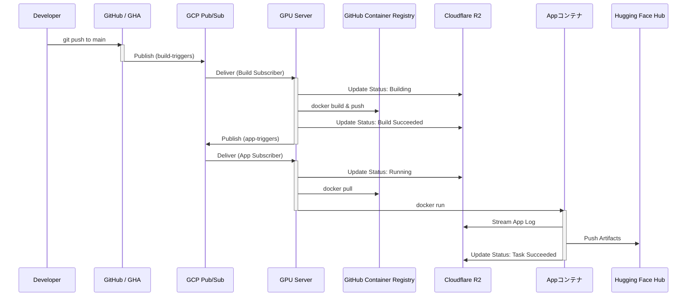

# GCP Pub/SubとGHAを活用したCI/CDシステム概要書

## 1. 概要

本ドキュメントは、GitHubリポジトリへのプッシュをトリガーとして、機械学習モデルの学習やデータ処理などのアプリケーションを自動でビルド・実行し、成果物を公開するCI/CD（継続的インテグレーション/継続的デプロイメント）システムの設計思想と動作について記述するものです。

本システムは、GitOpsの思想を基盤とし、**GitHub Actions (GHA)**、**Google Cloud Pub/Sub**、**GitHub Container Registry (GHCR)** を組み合わせた、信頼性・拡張性・観測性の高いイベント駆動型アーキテクチャを採用しています。さらに、**Cloudflare R2**と**Cloudflare Pages**を活用したダッシュボード機能により、全てのプロセスの状態をリアルタイムで監視可能です。

## 2. コンセプト

開発者がGitリポジトリにソースコードをプッシュすると、その変更が即座にパイプラインを起動します。システムは一連のプロセスを自動で実行し、GPUリソースを活用したコンテナアプリケーションのビルド、GHCRへの登録、GPUサーバーでの実行、そして最終的な成果物のHugging Face Hubへの公開までをシームレスに行います。この全ての過程におけるログとステータスはCloudflare R2に集約され、ダッシュボードで可視化されます。

## 3. ユビキタス言語

* **GPUサーバー**: アプリケーションコンテナを実行するための、NVIDIA GPUを搭載した計算機リソース。
* **ジョブID**: `git push`によってトリガーされた一連のパイプライン全体を指す一意のID。通常、コミットハッシュが使用される。
* **パイプライン**: コードプッシュからビルド、実行、成果物公開までの一連のプロセス全体。

## 4. 主要コンポーネントとアーキテクチャ

### 4.1. GitHub / GitHub Actions (GHA)

* **役割**: パイプラインのトリガーとオーケストレーション。
* **動作**:
    1.  リポジトリの`.github/workflows/ci-cd.yml`に定義されたワークフローを、`main`ブランチへのプッシュをトリガーとして実行します。
    2.  GCPサービスアカウントキーなどの認証情報は、GitHub Secretsに安全に保管し、ワークフロー内で利用します。
    3.  **ビルド要求の発行**: ジョブID（コミットハッシュ）、リポジトリ名などを含むメッセージをJSON形式で生成し、GCP Pub/Subの`build-triggers`トピックにパブリッシュします。**この時点ではアプリケーション実行のトリガーは発行しません。**

### 4.2. GCP Pub/Sub

* **役割**: システムコンポーネント間の非同期メッセージングハブ。
* **動作**: 各コンポーネントからのメッセージをトピックで受け取り、サブスクライバーにリアルタイムで配信します。
    * **`build-triggers` (トピック)**: コンテナビルドの要求を管理します。
    * **`app-triggers` (トピック)**: アプリケーション実行の要求を管理します。

### 4.3. GPUサーバー

* **役割**: アプリケーションのビルドと実行、およびステータス報告を担当するコアコンポーネント。
* **動作**: サーバー上で2種類のサブスクライバープロセスが常時稼働しています。

    * **Build Subscriber (`/whaled/build`)**:
        1.  `build-triggers`トピックを購読します。
        2.  メッセージ受信後、「ビルド開始」ステータスをCloudflare R2にアップロードします。
        3.  `docker build`を実行し、ビルドログをR2にストリーミングします。
        4.  **成功時**:
            * ビルドしたイメージをGHCRにプッシュします。
            * 「ビルド成功」ステータスとイメージURIをR2に記録します。
            * 次のステップとして、ジョブIDとイメージURIを含むメッセージを`app-triggers`トピックにパブリッシュします。
        5.  **失敗時**: 「ビルド失敗」ステータスとエラーログをR2に記録し、プロセスを終了します。

    * **App Subscriber (`/whaled/app`)**:
        1.  `app-triggers`トピックを購読します。
        2.  メッセージ受信後、「実行準備中」ステータスをR2にアップロードします。
        3.  GHCRからメッセージで指定されたイメージをプルし、`docker run`でコンテナを実行します。

### 4.4. App (アプリケーションコンテナ)

* **役割**: ジョブの主処理を実行し、詳細な進捗を報告するアプリケーション。
* **動作**:
    1.  起動後、Cloudflare R2に「タスク開始」ステータスをアップロードします。
    2.  機械学習の学習やデータ処理を実行し、そのログをR2にストリーミングします。
    3.  処理完了後、成果物をHugging Face Hubにプッシュします。
    4.  「タスク成功」ステータスとHugging Face HubのURLをR2に記録し、コンテナを終了します。失敗時は「タスク失敗」ステータスを記録します。

### 4.5. Cloudflare R2

* **役割**: 全てのログとステータス情報を集約するオブジェクトストレージ。
* **データ構造**: ジョブIDごとにフォルダが作成され、状態を記録する`status.json`とログファイルが保存されます。
    ```
    /{ジョブID}/
    ├── status.json
    ├── build.log
    └── app.log
    ```
* **`status.json`の例**:
    ```json
    {
      "jobId": "a1b2c3d4",
      "overallStatus": "Succeeded",
      "timestamps": {
        "created": "2025-06-18T14:30:00Z",
        "updated": "2025-06-18T14:55:00Z"
      },
      "build": {
        "status": "Succeeded",
        "log": "/a1b2c3d4/build.log",
        "imageUri": "ghcr.io/user/repo:a1b2c3d4"
      },
      "run": {
        "status": "Succeeded",
        "log": "/a1b2c3d4/app.log",
        "artifactUrl": "[https://huggingface.co/user/model/a1b2c3d4](https://huggingface.co/user/model/a1b2c3d4)"
      }
    }
    ```

### 4.6. Dashboard (Cloudflare Pages)

* **役割**: システム全体の状態を可視化するWebインターフェース。
* **動作**:
    1.  R2に保存されている`status.json`ファイルをリスト表示し、パイプラインの全体像を提示します。
    2.  各ジョブの詳細画面では、ログファイルへのリンクや成果物へのリンクを提供します。
    3.  失敗したジョブを再実行するためのトリガーボタンを設置することも可能です。

## 5. 実行フロー

1.  **コードプッシュ**: 開発者が`main`ブランチに`git push`します。
2.  **GHAトリガー**: GitHub Actionsが起動し、`build-triggers`トピックにメッセージを発行します。
3.  **ビルドプロセス**: Build Subscriberがメッセージを受信し、コンテナイメージをビルドしてGHCRにプッシュします。全ての進捗はR2に記録されます。
4.  **実行トリガー**: ビルドが成功すると、Build Subscriberは`app-triggers`トピックにメッセージを発行します。
5.  **実行プロセス**: App Subscriberがメッセージを受信し、GHCRからイメージをプルして`app`コンテナを実行します。
6.  **タスク実行と成果物公開**: `app`コンテナが主処理を行い、完了後、成果物をHugging Face Hubにアップロードします。進捗と結果はR2に記録されます。
7.  **ダッシュボードでの可視化**: ユーザーはダッシュボードで、R2に記録された最新情報に基づき、パイプラインの進行状況をリアルタイムに把握します。

## 6. シーケンス図


